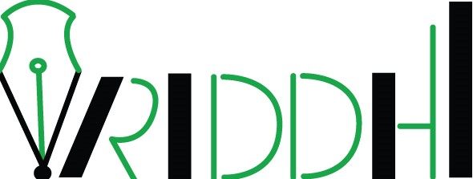

# Atmanirbhar Bharat: Vriddhi

This is a basic GitHub repository by Team Vriddhi, as part of Atmanirbhar Bharat competition

## Contents

1. [Short Description](#short-description)
1. [Demo Video](#demo-video)
1. [The Architecture](#the-architecture)
1. [Long Description](#long-description)
1. [Ease of use](#Ease-of-use)
1. [Robustness](#Robustness)
1. [Security Features](#Security-Features)
1. [Scalability](#Scalability)
1. [Project Roadmap](#project-roadmap)
1. [Getting Started](#getting-started)
1. [Access the Application](#Access-the-Application)
1. [Built With](#built-with)
1. [Contributors](#contributors)

## Short Description

### What's the problem?

Access to quality education is limited in India and not every person has access to required tools and resources to pursue their dreams.
This is more so for people who are less privileged or living in rural areas. Rural population in India is reported to be around 65.97% according to World Bank in 2018 with an annual growth rate of 0.39%.
The current COVID crisis has further worsen the situation. Due to schools being closed, there is lack of tutoring, mentoring and study groups. Parents are not in a position or have the relevant capabilities to provide academic support. The private tutorials may not be affordable to most people from rural areas or low-income groups. Additional challenge is the lack of tutoring support in regional languages.
Many students are deprived of good guidance and quality education which in turn is one of the key causes for the societal imbalance.

### How can technology help

With the current technological advancements and on our path to digital India, bridging this gap is not anymore, a challenge. Right idea combined with right tools and resources can now connect people across the globe within a glimpse.
Advanced mobile technology has made this possible, with reduced cost and affordability, today most of the homes have a smart phone. Estimated smart phone users in India in 2020 is 400 million. What better way to connect using this device? Given the current Covid-19 situation, the whole world has switched to a virtual landscape.
A portable solution for an ongoing problem is what the technology will help with. With technology disruption, lot of new business models have been developed and successful. Today, one can access any kind of information from any remote location.
An infrastructure to integrate these needs is done through the Vriddhi App.

### The Idea

Develop a digital platform to provide a live connect between students, tutors, counsellors, industry leaders and a huge repository of educational materials that is open source. 
Secure, seamless, and sustainable solution to solve the above problem that will benefit the society at large. The model to be scalable globally and cater to different economic sections of the society.  
Aim is to also support tutoring, mentoring and library of education materials in regional languages, all in one platform. 

## Demo Video

## The architecture

1. The user installs the site via play store/app store.
2. Logs in via phone number/email
3. Selects his/her profile type and services required
4. Vriddhi app connects users to large variety of resources available on platform
5. More people on the platform, better the resource availability
 

## Long description

[More detail is available here](https://github.com/teamvridhi/Vriddhi_Submission/blob/master/Vriddhi%20Concept.pdf)

Vriddhi provides a platform for young minds to access learning anytime, anywhere at their convenience and varied choices of topics or areas of interest. Our goal is to build a community of students, tutors, counselors from different sections of society and walk of life, irrespective of the kind of education they are currently receiving or the curriculum they are following. 
What differentiates Vriddhi from other learning apps is that it offers live sessions free of cost ; over and above the learning support, it provides career guidance and learning materials in a digitized one stop solution platform. Vriddhi will also enable students to form live study groups and learn from each other.
The tutors can be any individuals who has the passion to teach and share knowledge. Professionals to corporates or from any other individual can contribute in developing an informed and educated society. 
Students from remote places/ lower income groups may not have the access and the right exposure to various career options available. Connecting them to professional counsellors and other professionals from various industries and walks of life would help them make informed decisions about their career to facilitate a coherent educational trajectory.   
Apart from learning and career guidance, Vriddhi provides a library of study materials, relevant links and FAQs for easy reference. 
Vriddhi will also enable students to form study groups with similar learning path and interest areas.

## Ease of use: 
Vriddhi app is designed keeping in mind accessibility for children aged five and above. Some of the key features, which make it easy to use:
-	It has easy login feature and intuitive interface, which allows users to easily move across the application pages. 
-	App will also incorporate multiple Indian language options to enable non-English speakers to utilize the app easily.
-	All major features come with easy to recognize icons, allowing users with reading limitation to access the application
-	Chat and Video features are specially focused on helping students and teachers connect instantly and get their questions answered.
-	Application has a help feature to allow users access to instant troubleshooting

## Robustness: 
Vriddhi app has comprehensive build, test, maintain strategy to make the app robust. 
-	App UX is designed to keep it light and intuitive for users. It would require almost no training of technology knowledge at user’s end 
-	There is a comprehensive testing strategy in place for both UX and backend. Before launch, app will be tested with a large pilot group, within select housing societies in Bangalore, to asses’ possible bottlenecks. This will then be fixed before release. Similarly, there would continuous improvements and AB testing.
-	Vriddhi is a community-based app. As Vriddhi community expands, the advantages will increase manifold. We will also tie-up with corporates and NGOs for making sure advantages of the app reaches to all needy 

## Security Features:
-	Viriddhi app has been designed, keeping in mind, data security and privacy issues faced in todays interconnected world. Vriddhi provides student, teachers, and counsellors a secure and easy to use platform to exchange information and learn from each other. Some of the best in class secure features used are:
-	Single Sign-On: Vriddhi allows users to login using google and Facebook authentication. This not only allows ease of usage but also leverages sophisticated authentical and certification used by these ‘best in class’ organizations. Vriddhi uses cloud-based authentication services for enhanced data security and privacy.
-	Two Step Authentication: Vriddhi app has two factor authentications implemented for greater security. It will require user to login using both password and OTP. This would allow users to secure their login against any possible threat.
-	SSL Encryption: Vriddhi will be using SSL encryption for any data stored on its platform. This will encrypt the data and make safe against any hacking during data transfer.
-	App vulnerability testing: Vriddhi will implement enhanced security measures to counter threats due to IoT integration. We will be conducting regular vulnerability tests to identify loopholes due to changing technology and putting in additional security measures as and when threats are identified. 
-	Safety of users on the platform: Vriddhi will be implementing measures to ensure safety of its users by mandating valid ID card, endorsements from the corporates/NGOs, schools, or employers. Additionally, any behavioral complain will be promptly investigated and acted upon.  Users with consistently poor ratings or review would be backlisted to improve learning experience

## Scalability:
Vridhi’s vision is to make this app available to every child in India and eventually scale it up to global level. With that in mind, we have built the app in framework which is easily scalable to handle increased load. Below are some of the key focus areas are:
-	Smooth performance by using best in class app development framework
-	Continuous availability of app for users in remote areas by introducing a light app version with limited features
-	Fast performance and data retrieval capabilities by using enterprise lever database services
-	Realtime response to any issue using troubleshoot feature

## Project roadmap

## Getting started

These instructions will get you a copy of the project up and running on your local machine for development and testing purposes. See deployment for notes on how to deploy the project on a live system.

## Access the Application

Click on :
* Main App - underdevelopment - [Vriddhi](https://github.com/prateekralhan/flutter_apps/tree/master/flutter_app) 
* Wireframe - [Vriddhi WireFrame](https://studio.code.org/projects/applab/33V6Be9slUCl96Y1kC-sFBn4zEYiUdH0GVSmQC3mrLY)

## Built with

* [Flutter](https://flutter.dev/)
* WebRTC (https://webrtc.org/)
* Cluod Computing
* Custome built AI Model
* Video using powtoon
* Wireframe credit to code.org

## Contributors

* **Anitha Ravishankar** - *Strategy & Communication*
* **Hemalatha Dave** - *Conceptualization and Implementation*
* **Shweta Kumari** - *Conceptualization and Data Engineering*
* **Prateek Rehlan** - *Conceptualization & Implementation*
* **Sumit Kumar** - *Conceptualization & Implementation*

