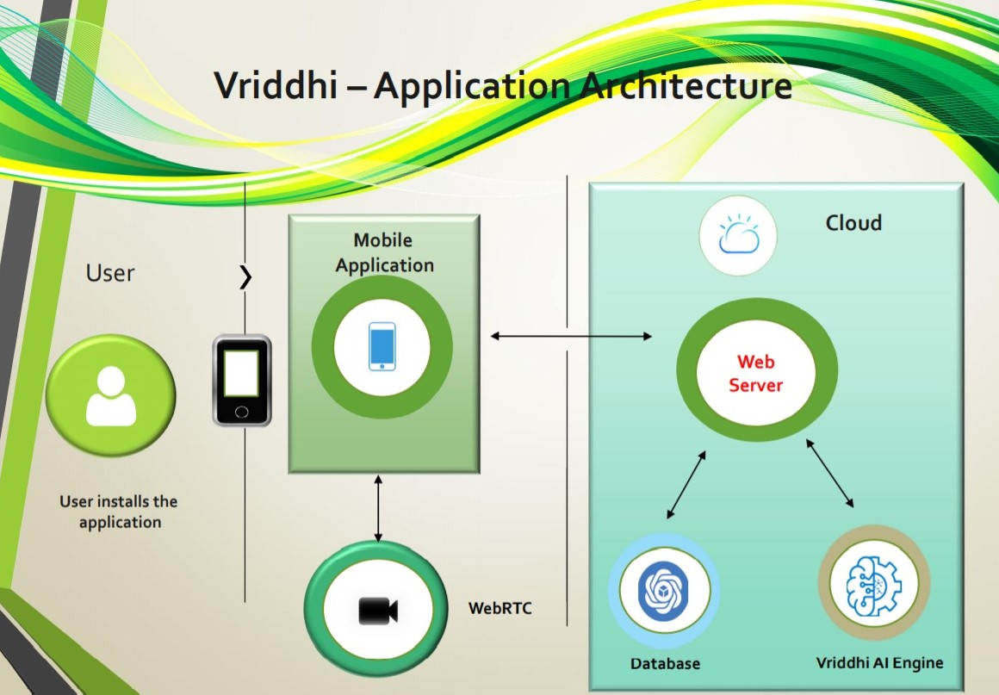

# Atmanirbhar Bharat: Vriddhi

This is a basic GitHub repository by Team Vriddhi, as part of Atmanirbhar Bharat competition

## Contents

1. [Short Description](#short-description)
1. [Demo Video](#demo-video)
1. [The Architecture](#the-architecture)
1. [Long Description](#long-description)
1. [Project Roadmap](#project-roadmap)
1. [Getting Started](#getting-started)
1. [Access the Application](#Access-the-Application)
1. [Built With](#built-with)
1. [Contributors](#contributors)

## Short Description

### What's the problem?

Access to quality education is limited in India and not every person has access to required tools and resources to pursue their dreams.
This is more so for people who are less privileged or living in rural areas. Rural population in India is reported to be around 65.97% according to World Bank in 2018 with an annual growth rate of 0.39%.
The current COVID crisis has further worsen the situation. Due to schools being closed, there is lack of tutoring, mentoring and study groups. Parents are not in a position or have the relevant capabilities to provide academic support. The private tutorials may not be affordable to most people from rural areas or low-income groups. Additional challenge is the lack of tutoring support in regional languages.
Many students are deprived of good guidance and quality education which in turn is one of the key causes for the societal imbalance.

### How can technology help

With the current technological advancements and on our path to digital India, bridging this gap is not anymore, a challenge. Right idea combined with right tools and resources can now connect people across the globe within a glimpse.
Advanced mobile technology has made this possible, with reduced cost and affordability, today most of the homes have a smart phone. Estimated smart phone users in India in 2020 is 400 million. What better way to connect using this device? Given the current Covid-19 situation, the whole world has switched to a virtual landscape.
A portable solution for an ongoing problem is what the technology will help with. With technology disruption, lot of new business models have been developed and successful. Today, one can access any kind of information from any remote location.
An infrastructure to integrate these needs is done through the Vriddhi App.

### The Idea

Develop a digital platform to provide a live connect between students, tutors, counsellors, industry leaders and a huge repository of educational materials that is open source. 
Secure, seamless, and sustainable solution to solve the above problem that will benefit the society at large. The model to be scalable globally and cater to different economic sections of the society.  
Aim is to also support tutoring, mentoring and library of education materials in regional languages, all in one platform. 

## Demo Video

## The architecture

1. The user installs the site via playstore/app store.
2. Logs in via phone number/email
3. Selects his/her profile type and services required
4. Vriddhi app connets users to large varitity of resources available on platform
5. More people come on platform the better resource avaiability 

## Long description

[More detail is available here](https://github.com/teamvridhi/Vriddhi_Submission/blob/master/Vriddhi%20Concept.pdf)

## Project roadmap

## Getting started

These instructions will get you a copy of the project up and running on your local machine for development and testing purposes. See deployment for notes on how to deploy the project on a live system.

## Access the Application

Click on : [Vriddhi](https://github.com/prateekralhan/flutter_apps/tree/master/flutter_app) 

## Built with

* [Flutter](https://flutter.dev/)
* WebRTC (https://webrtc.org/)
* Cluod Computing
* Custome built AI Model

## Contributors

* **Anitha Ravishankar** - *Strategy & Communication*
* **Hemalatha Dave** - *Conceptualization and Implimentation*
* **Shweta Kumari** - *Conceptualization and Data Engineering*
* **Prateek Rehlan** - *Conceptualization & Implimentation*
* **Sumit Kumar** - *Conceptualization & Implimentation*
